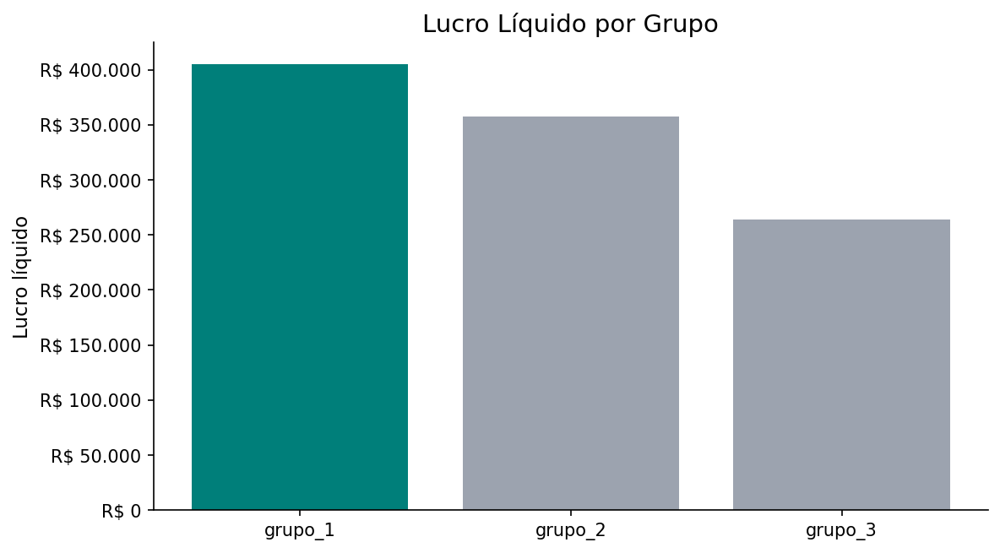
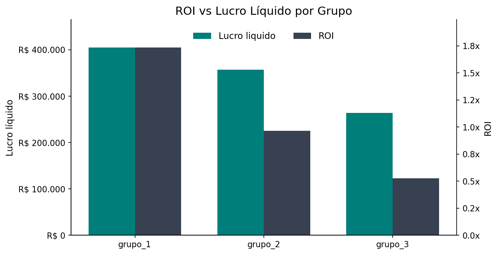
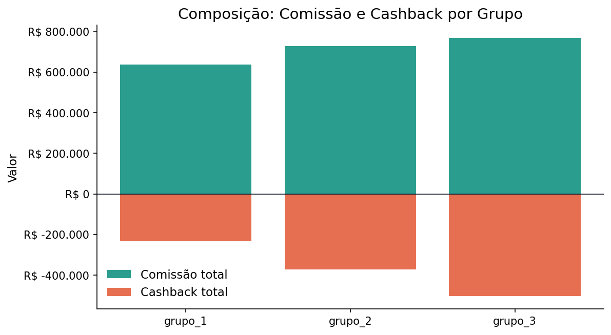
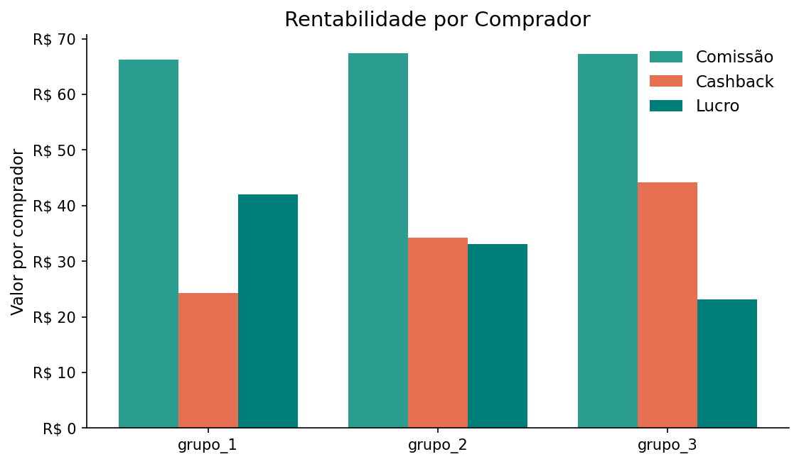
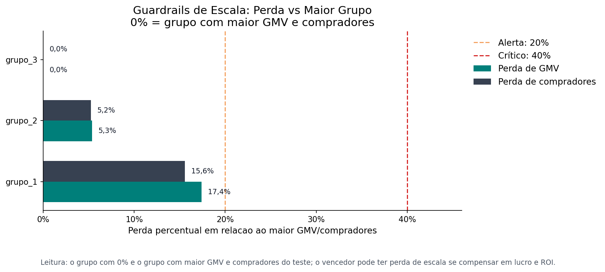

# Relatorio A/B Cashback - parceiro_a

- Periodo: 2011-01-01 a 2011-04-02
- Total de dias: 92
- Grupos avaliados: grupo_1, grupo_2, grupo_3

## Decisao calculada

- Status: vencedor_definido
- Vencedor: grupo_1
- Motivo: consenso
- Recomendacao: Escalar grupo_1 para 100% do trafego.

## Tabela de KPIs

| Grupo | Elegivel | Lucro liquido | ROI | Lucro/comprador | GMV | Compradores | Cashback total | Margem GMV | Escala GMV | Escala compradores |
| --- | --- | --- | --- | --- | --- | --- | --- | --- | --- | --- |
| grupo_1 | sim | R$ 404.711,00 | 1,73x | R$ 42,01 | R$ 5.605.173,00 | 9.633 | R$ 233.424,00 | 7,2% | ok | ok |
| grupo_2 | sim | R$ 357.519,00 | 0,96x | R$ 33,06 | R$ 6.423.096,00 | 10.814 | R$ 370.659,00 | 5,6% | ok | ok |
| grupo_3 | sim | R$ 264.287,00 | 0,52x | R$ 23,16 | R$ 6.785.856,00 | 11.410 | R$ 503.600,00 | 3,9% | ok | ok |

## Graficos

### Lucro Liquido

### ROI vs Lucro Liquido

### Composicao Comissao Cashback

### Rentabilidade por Comprador

### Guardrails de Escala

**Sumário executivo**

O vencedor do teste é **grupo_1**, e a decisão calculada foi **Escalar grupo_1 para 100% do trafego.**. A sustentação está no consenso entre lucro e eficiência: o grupo_1 lidera em lucro líquido e ROI, sem qualquer alerta de guardrail ou elegibilidade, o que dá segurança para a escala.

**Lucro líquido total + ROI + Lucro por comprador + GMV**

O grupo_1 combina **R$ 404.711,00** de lucro líquido, **1,73x** de ROI, **R$ 42,01** de lucro por comprador e **R$ 5.605.173,00** de GMV, ficando à frente de grupo_2 (**R$ 357.519,00**, **0,96x**, **R$ 33,06**, **R$ 6.423.096,00**) e grupo_3 (**R$ 264.287,00**, **0,52x**, **R$ 23,16**, **R$ 6.785.856,00**). O trade-off aqui é claro: o grupo_1 entrega menos GMV que os concorrentes, mas transforma esse volume em resultado financeiro e eficiência superiores. Isso explica por que a decisão favorece grupo_1 mesmo sem liderar a escala de GMV.

**ROI + Cashback total + Cashback sobre GMV**

No custo de incentivo, o grupo_1 também se destaca com **1,73x** de ROI, **R$ 233.424,00** de cashback total e **4,2%** de cashback sobre GMV, enquanto grupo_2 fica em **0,96x**, **R$ 370.659,00** e **5,8%**, e grupo_3 em **0,52x**, **R$ 503.600,00** e **7,4%**. O principal trade-off é eficiência versus custo: os grupos 2 e 3 gastam mais incentivo sobre a receita, mas entregam menor retorno. Isso reforça a escolha do grupo_1, porque o cashback mais contido vem acompanhado do melhor retorno financeiro.

**Lucro por comprador + Comissão por comprador + Cashback por comprador**

Em rentabilidade unitária, o grupo_1 gera **R$ 42,01** de lucro por comprador, com **R$ 66,24** de comissão por comprador e **R$ 24,23** de cashback por comprador; grupo_2 fica em **R$ 33,06**, **R$ 67,34** e **R$ 34,28**, e grupo_3 em **R$ 23,16**, **R$ 67,30** e **R$ 44,14**. O ponto central é que o ganho por comprador cai conforme o cashback por comprador sobe, e o grupo_1 é o mais equilibrado nessa relação. Mesmo que o grupo_1 não tenha o maior volume de compradores, ele é o que mais converte cada comprador em valor para o negócio, o que sustenta a decisão de escala.

**Riscos e limitações**

Não há alertas nos guardrails e todos os grupos estão elegíveis, com escala_gmv e escala_compradores marcados como **ok**. Também não há empate técnico nem ausência de vencedor; o ranking confirma grupo_1 na primeira posição, seguido por grupo_2 e grupo_3, então a recomendação já vem fechada pelo sistema.

**Próximo passo recomendado**

Escalar o grupo_1 para 100% do tráfego e acompanhar a manutenção de ROI, lucro líquido e cashback sobre GMV na operação em produção.

## Apendice de auditoria

### Blocos escolhidos pela LLM
- decisao_impacto_eficiencia_escala
- decisao_eficiencia_cashback
- decisao_rentabilidade_unitaria

### Rankings dos KPIs de decisao

#### Ranking por Lucro liquido

| Posicao | Grupo | Valor | Elegivel |
| --- | --- | --- | --- |
| 1 | grupo_1 | R$ 404.711,00 | sim |
| 2 | grupo_2 | R$ 357.519,00 | sim |
| 3 | grupo_3 | R$ 264.287,00 | sim |

#### Ranking por ROI

| Posicao | Grupo | Valor | Elegivel |
| --- | --- | --- | --- |
| 1 | grupo_1 | 1,73x | sim |
| 2 | grupo_2 | 0,96x | sim |
| 3 | grupo_3 | 0,52x | sim |

#### Ranking por Lucro por comprador

| Posicao | Grupo | Valor | Elegivel |
| --- | --- | --- | --- |
| 1 | grupo_1 | R$ 42,01 | sim |
| 2 | grupo_2 | R$ 33,06 | sim |
| 3 | grupo_3 | R$ 23,16 | sim |

#### Ranking por GMV

| Posicao | Grupo | Valor | Elegivel |
| --- | --- | --- | --- |
| 1 | grupo_3 | R$ 6.785.856,00 | sim |
| 2 | grupo_2 | R$ 6.423.096,00 | sim |
| 3 | grupo_1 | R$ 5.605.173,00 | sim |

#### Ranking por Compradores totais

| Posicao | Grupo | Valor | Elegivel |
| --- | --- | --- | --- |
| 1 | grupo_3 | 11.410 | sim |
| 2 | grupo_2 | 10.814 | sim |
| 3 | grupo_1 | 9.633 | sim |
