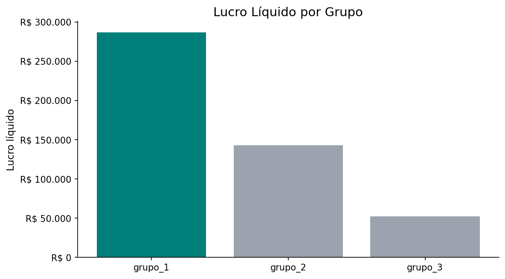
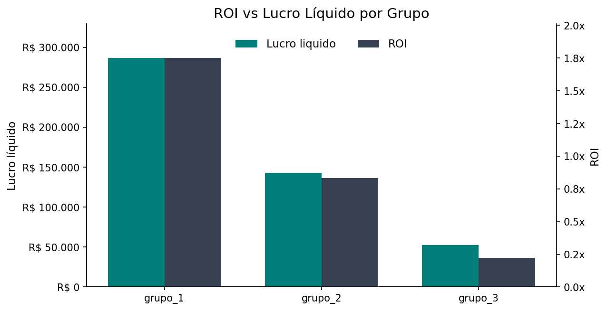
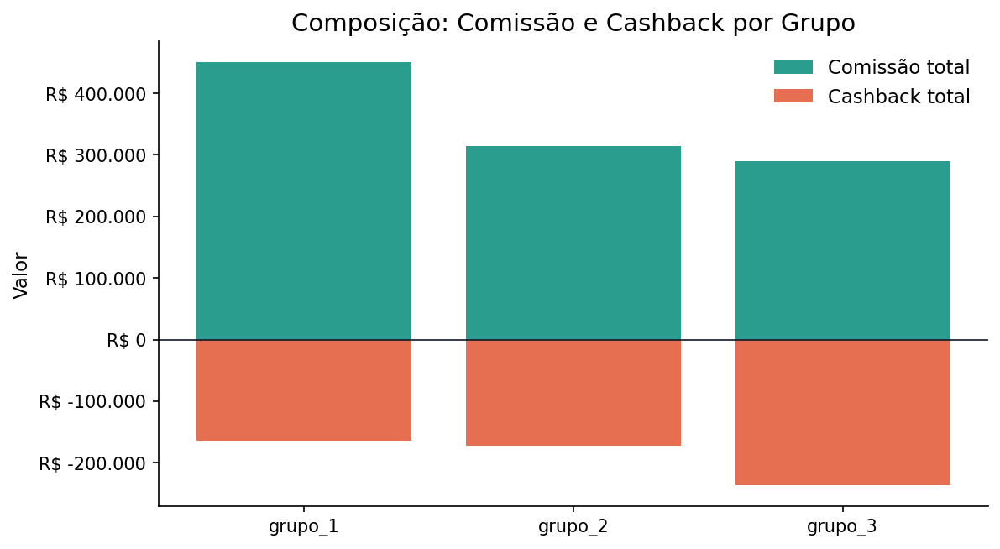
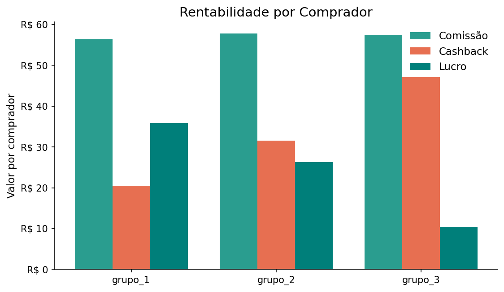
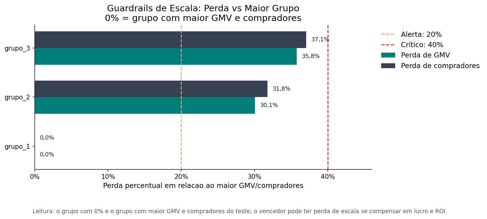

# Relatorio A/B Cashback - parceiro_b

- Periodo: 2011-05-01 a 2011-06-30
- Total de dias: 61
- Grupos avaliados: grupo_1, grupo_2, grupo_3

## Decisao calculada

- Status: vencedor_definido
- Vencedor: grupo_1
- Motivo: consenso
- Recomendacao: Escalar grupo_1 para 100% do trafego.

## Tabela de KPIs

| Grupo | Elegivel | Lucro liquido | ROI | Lucro/comprador | GMV | Compradores | Cashback total | Margem GMV | Escala GMV | Escala compradores |
| --- | --- | --- | --- | --- | --- | --- | --- | --- | --- | --- |
| grupo_1 | sim | R$ 286.570,00 | 1,75x | R$ 35,87 | R$ 4.093.818,00 | 7.990 | R$ 163.751,00 | 7,0% | ok | ok |
| grupo_2 | sim | R$ 143.157,00 | 0,83x | R$ 26,26 | R$ 2.863.019,00 | 5.452 | R$ 171.778,00 | 5,0% | alerta | alerta |
| grupo_3 | sim | R$ 52.593,00 | 0,22x | R$ 10,46 | R$ 2.629.963,00 | 5.029 | R$ 236.697,00 | 2,0% | alerta | alerta |

## Graficos

### Lucro Liquido

### ROI vs Lucro Liquido

### Composicao Comissao Cashback

### Rentabilidade por Comprador

### Guardrails de Escala

## Sumário executivo
O **grupo_1** foi o vencedor definido no teste, e a recomendação final é **"Escalar grupo_1 para 100% do trafego."**. A decisão se sustenta porque o grupo_1 lidera em lucro líquido, ROI, lucro por comprador e GMV, enquanto os demais grupos ficam atrás em resultado financeiro e eficiência; além disso, há dois grupos com guardrails de escala em alerta, o que reforça a preferência pelo grupo_1.

## Lucro líquido total + ROI + Lucro por comprador + GMV
O grupo_1 combina **R$ 286.570,00** de lucro líquido com **1,75x** de ROI, **R$ 35,87** de lucro por comprador e **R$ 4.093.818,00** de GMV, formando o melhor conjunto de impacto financeiro e escala entre os três grupos. O grupo_2 entrega **R$ 143.157,00** de lucro líquido, **0,83x** de ROI, **R$ 26,26** de lucro por comprador e **R$ 2.863.019,00** de GMV, enquanto o grupo_3 fica em **R$ 52.593,00**, **0,22x**, **R$ 10,46** e **R$ 2.629.963,00**, respectivamente.
A leitura desse bloco é direta: o grupo_1 não só gera mais lucro total, como também converte melhor esse volume em retorno e valor unitário por comprador. Isso favorece a decisão calculada porque o vencedor lidera os quatro sinais do bloco e entrega o melhor equilíbrio entre rentabilidade e escala.

## Lucro líquido total + GMV + Compradores totais
O grupo_1 também lidera em volume relevante, com **R$ 286.570,00** de lucro líquido, **R$ 4.093.818,00** de GMV e **7.990 compradores**. O grupo_2 registra **R$ 143.157,00**, **R$ 2.863.019,00** e **5.452 compradores**, enquanto o grupo_3 mostra **R$ 52.593,00**, **R$ 2.629.963,00** e **5.029 compradores**.
Esse bloco mostra que o lucro do grupo_1 não veio de uma base pequena: ele combina maior volume transacionado e maior base de compradores. Em contraste, os demais grupos perdem tanto em resultado financeiro quanto em escala, então o vencedor sustenta a recomendação com mais força operacional.

## ROI + Cashback total + Cashback sobre GMV
Em eficiência de incentivo, o grupo_1 apresenta **1,75x** de ROI, **R$ 163.751,00** de cashback total e **4,0%** de cashback sobre GMV. O grupo_2 fica em **0,83x**, **R$ 171.778,00** e **6,0%**, e o grupo_3 em **0,22x**, **R$ 236.697,00** e **9,0%**.
Aqui, o trade-off é claro: o grupo_1 entrega o melhor retorno com menor intensidade de cashback sobre a receita, enquanto os grupos 2 e 3 gastam mais incentivo proporcionalmente e ainda assim geram menos eficiência. Mesmo quando o grupo_2 tem cashback total próximo ao vencedor, ele não converte esse gasto em retorno equivalente, o que reforça por que a decisão favorece o grupo_1.

## Lucro por comprador + Comissão por comprador + Cashback por comprador
No nível unitário, o grupo_1 gera **R$ 35,87** de lucro por comprador, com **R$ 56,36** de comissão por comprador e **R$ 20,49** de cashback por comprador. O grupo_2 entrega **R$ 26,26**, **R$ 57,77** e **R$ 31,51**, enquanto o grupo_3 fica em **R$ 10,46**, **R$ 57,52** e **R$ 47,07**.
Esse bloco evidencia que o vencedor captura mais valor por comprador mesmo sem ser o mais agressivo em cashback por pessoa; já o grupo_3 converte uma parcela maior em incentivo por comprador, mas isso se traduz no pior lucro unitário. A decisão continua bem sustentada porque o grupo_1 equilibra melhor a remuneração do tráfego com geração de valor, enquanto os outros grupos têm menor rentabilidade por comprador.

## Riscos e limitações
Os guardrails mostram **alerta** de escala de GMV e de compradores para os grupos **2** e **3**, o que limita a leitura de crescimento desses cenários. Não há alertas registrados na decisão nem empate técnico, e todos os grupos são elegíveis; ainda assim, o ranking mantém o grupo_1 na frente em lucro líquido e ROI, com os demais grupos atrás.

## Próximo passo recomendado
Escalar o **grupo_1** para 100% do tráfego e acompanhar a evolução de lucro, ROI e GMV para confirmar a manutenção do desempenho em escala.

## Apendice de auditoria

### Blocos escolhidos pela LLM
- decisao_impacto_eficiencia_escala
- decisao_lucro_volume
- decisao_eficiencia_cashback
- decisao_rentabilidade_unitaria

### Rankings dos KPIs de decisao

#### Ranking por Lucro liquido

| Posicao | Grupo | Valor | Elegivel |
| --- | --- | --- | --- |
| 1 | grupo_1 | R$ 286.570,00 | sim |
| 2 | grupo_2 | R$ 143.157,00 | sim |
| 3 | grupo_3 | R$ 52.593,00 | sim |

#### Ranking por ROI

| Posicao | Grupo | Valor | Elegivel |
| --- | --- | --- | --- |
| 1 | grupo_1 | 1,75x | sim |
| 2 | grupo_2 | 0,83x | sim |
| 3 | grupo_3 | 0,22x | sim |

#### Ranking por Lucro por comprador

| Posicao | Grupo | Valor | Elegivel |
| --- | --- | --- | --- |
| 1 | grupo_1 | R$ 35,87 | sim |
| 2 | grupo_2 | R$ 26,26 | sim |
| 3 | grupo_3 | R$ 10,46 | sim |

#### Ranking por GMV

| Posicao | Grupo | Valor | Elegivel |
| --- | --- | --- | --- |
| 1 | grupo_1 | R$ 4.093.818,00 | sim |
| 2 | grupo_2 | R$ 2.863.019,00 | sim |
| 3 | grupo_3 | R$ 2.629.963,00 | sim |

#### Ranking por Compradores totais

| Posicao | Grupo | Valor | Elegivel |
| --- | --- | --- | --- |
| 1 | grupo_1 | 7.990 | sim |
| 2 | grupo_2 | 5.452 | sim |
| 3 | grupo_3 | 5.029 | sim |
