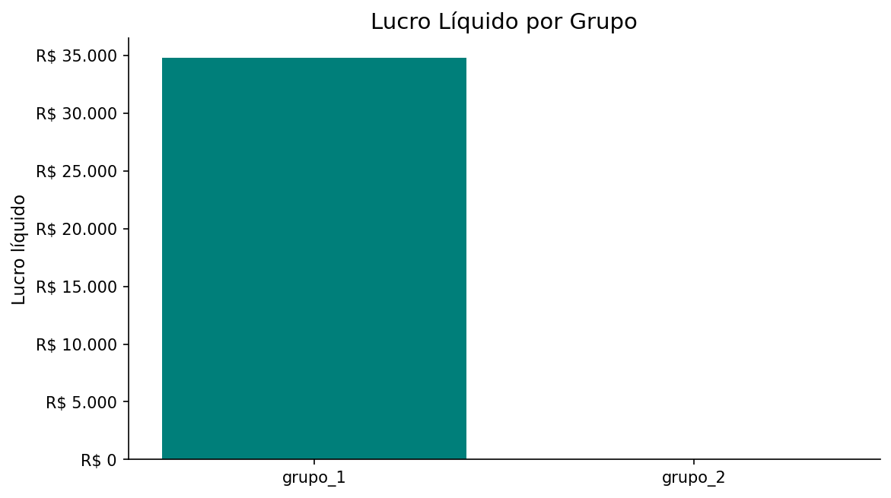
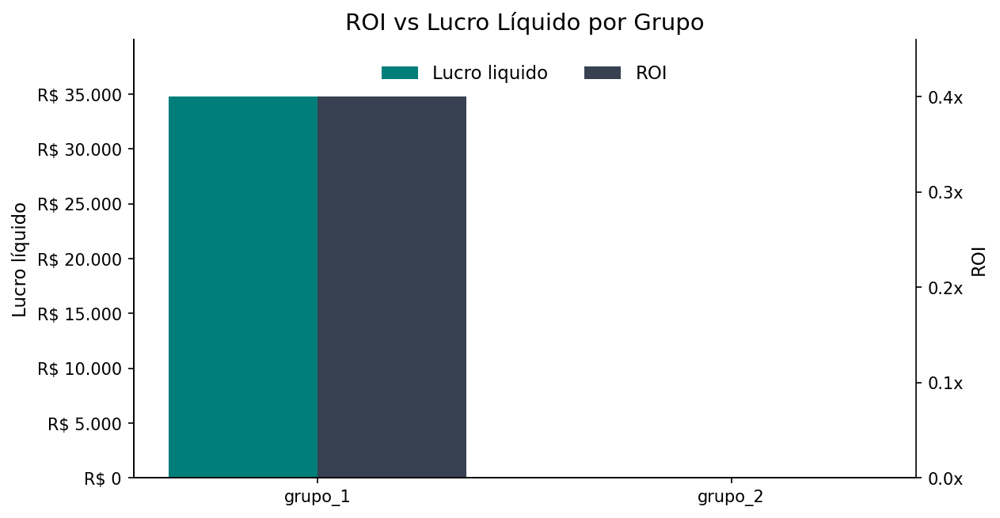
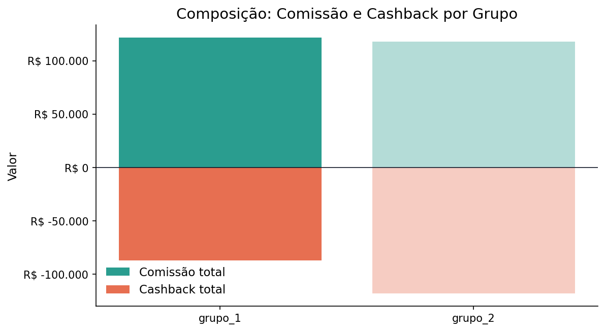
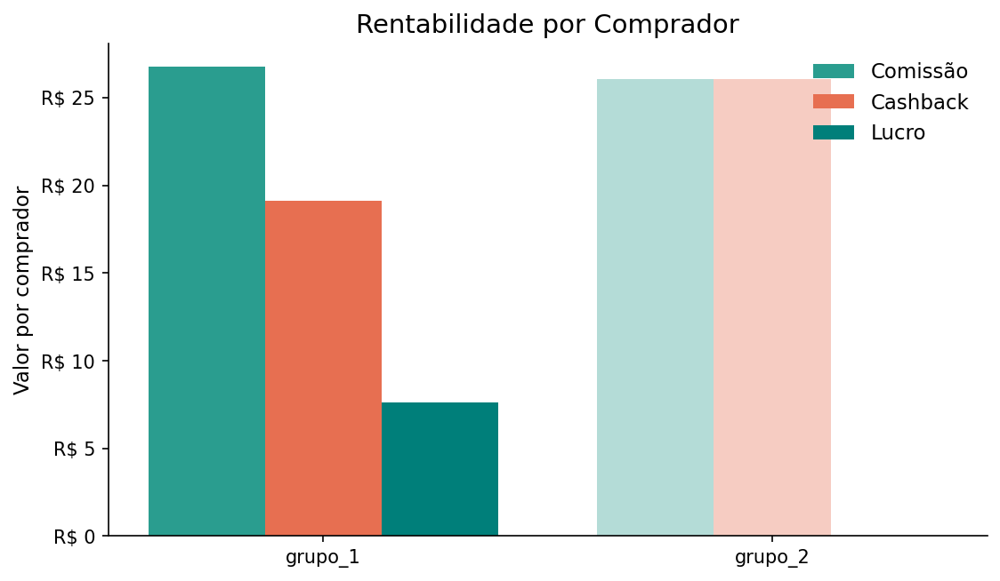
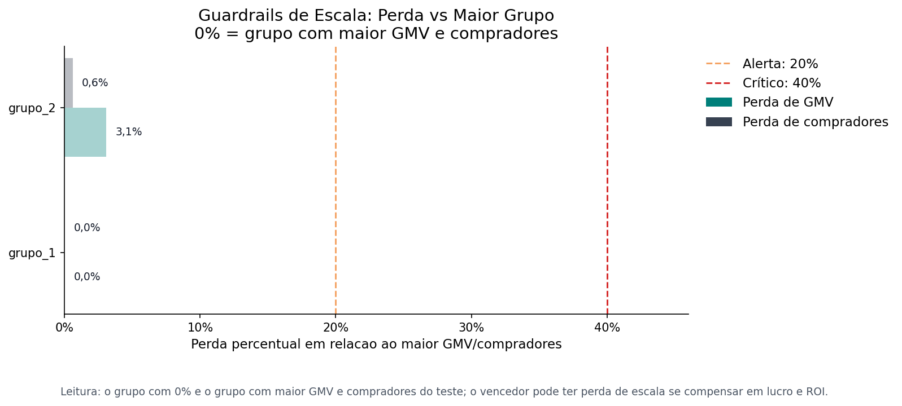

# Relatorio A/B Cashback - parceiro_c

- Periodo: 2011-07-01 a 2011-08-14
- Total de dias: 45
- Grupos avaliados: grupo_1, grupo_2

## Decisao calculada

- Status: vencedor_definido
- Vencedor: grupo_1
- Motivo: unico_elegivel
- Recomendacao: Escalar grupo_1 para 100% do trafego.
- Alertas:
  - Apenas um grupo passou nos criterios de elegibilidade.

## Tabela de KPIs

| Grupo | Elegivel | Lucro liquido | ROI | Lucro/comprador | GMV | Compradores | Cashback total | Margem GMV | Escala GMV | Escala compradores |
| --- | --- | --- | --- | --- | --- | --- | --- | --- | --- | --- |
| grupo_1 | sim | R$ 34.769,00 | 0,40x | R$ 7,64 | R$ 1.738.460,00 | 4.549 | R$ 86.924,00 | 2,0% | ok | ok |
| grupo_2 | nao | R$ 0,00 | 0,00x | R$ 0,00 | R$ 1.685.235,00 | 4.522 | R$ 117.967,00 | 0,0% | ok | ok |

## Graficos

### Lucro Liquido

### ROI vs Lucro Liquido

### Composicao Comissao Cashback

### Rentabilidade por Comprador

### Guardrails de Escala

### Sumário executivo
O grupo **grupo_1** foi definido como vencedor, e a recomendação calculada é **"Escalar grupo_1 para 100% do trafego."**. A decisão se sustenta porque ele foi o único grupo elegível; o alerta registrado confirma essa limitação: **"Apenas um grupo passou nos criterios de elegibilidade."**

### Lucro líquido total + ROI + Lucro por comprador + GMV
No bloco **Lucro liquido total + ROI + Lucro por comprador + GMV**, o **grupo_1** reúne **R$ 34.769,00** de lucro líquido, **0,40x** de ROI, **R$ 7,64** de lucro por comprador e **R$ 1.738.460,00** de GMV. Já o **grupo_2** não entrega lucro líquido, fica com **0,00x** de ROI e **R$ 0,00** de lucro por comprador, além de GMV de **R$ 1.685.235,00**. O trade-off aqui é claro: o grupo vencedor combina impacto financeiro positivo com eficiência e escala, enquanto o outro grupo não transforma volume em resultado; por isso, este bloco favorece diretamente a decisão calculada.

### ROI + Cashback total + Cashback sobre GMV
No bloco **ROI + Cashback total + Cashback sobre GMV**, o **grupo_1** opera com **0,40x** de ROI, **R$ 86.924,00** de cashback total e **5,0%** de cashback sobre GMV. O **grupo_2** apresenta **0,00x** de ROI, **R$ 117.967,00** de cashback total e **7,0%** de cashback sobre GMV, ou seja, consome mais incentivo para sustentar um resultado sem retorno. A leitura do bloco é que o grupo vencedor foi mais eficiente no uso do cashback; mesmo não liderando em gasto absoluto de incentivo, ele converteu esse investimento em retorno financeiro, o que explica por que a decisão calculada se mantém.

### Lucro por comprador + Comissao por comprador + Cashback por comprador
No bloco **Lucro por comprador + Comissao por comprador + Cashback por comprador**, o **grupo_1** entrega **R$ 7,64** de lucro por comprador, com **R$ 26,75** de comissão por comprador e **R$ 19,11** de cashback por comprador. O **grupo_2** fica em **R$ 0,00** de lucro por comprador, com **R$ 26,09** de comissão por comprador e **R$ 26,09** de cashback por comprador. O principal trade-off é rentabilidade unitária versus custo do incentivo: o vencedor gera valor por comprador mesmo com incentivo relevante, enquanto o outro grupo devolve todo o ganho em cashback e não captura lucro unitário; isso reforça a superioridade do grupo_1 na elegibilidade e no ranking.

### Riscos e limitações
A principal limitação é que houve **apenas um grupo elegível**, então a decisão não foi sustentada por disputa entre dois candidatos equivalentes. Nos guardrails, ambos os grupos estão com **escala_gmv = ok** e **escala_compradores = ok**, mas o **grupo_2** permanece inelegível, então não há base para escalá-lo mesmo com volume relevante. Não houve empate técnico, e o ranking já posiciona o **grupo_1** à frente com lucro líquido de **R$ 34.769,00**.

### Próximo passo recomendado
Escalar **grupo_1** para 100% do tráfego e manter monitoramento de ROI, lucro líquido e elegibilidade para validar a estabilidade do resultado em produção.

## Apendice de auditoria

### Blocos escolhidos pela LLM
- decisao_impacto_eficiencia_escala
- decisao_eficiencia_cashback
- decisao_rentabilidade_unitaria

### Rankings dos KPIs de decisao

#### Ranking por Lucro liquido

| Posicao | Grupo | Valor | Elegivel |
| --- | --- | --- | --- |
| 1 | grupo_1 | R$ 34.769,00 | sim |
| 2 | grupo_2 | R$ 0,00 | nao |

#### Ranking por ROI

| Posicao | Grupo | Valor | Elegivel |
| --- | --- | --- | --- |
| 1 | grupo_1 | 0,40x | sim |
| 2 | grupo_2 | 0,00x | nao |

#### Ranking por Lucro por comprador

| Posicao | Grupo | Valor | Elegivel |
| --- | --- | --- | --- |
| 1 | grupo_1 | R$ 7,64 | sim |
| 2 | grupo_2 | R$ 0,00 | nao |

#### Ranking por GMV

| Posicao | Grupo | Valor | Elegivel |
| --- | --- | --- | --- |
| 1 | grupo_1 | R$ 1.738.460,00 | sim |
| 2 | grupo_2 | R$ 1.685.235,00 | nao |

#### Ranking por Compradores totais

| Posicao | Grupo | Valor | Elegivel |
| --- | --- | --- | --- |
| 1 | grupo_1 | 4.549 | sim |
| 2 | grupo_2 | 4.522 | nao |
